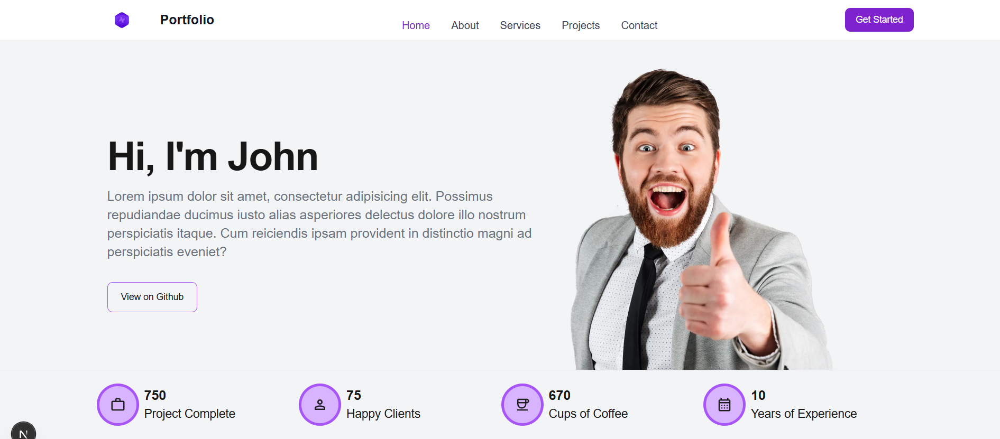
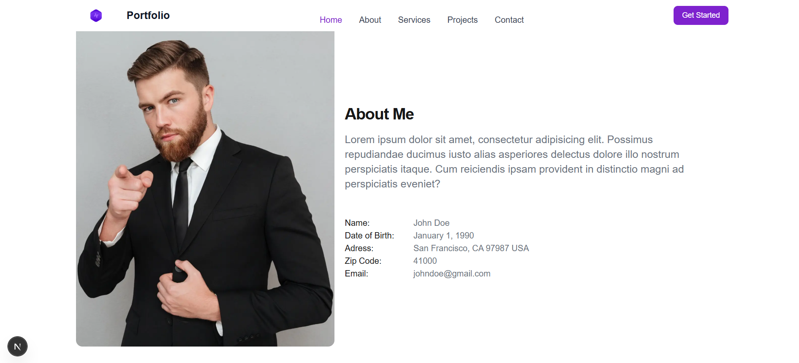
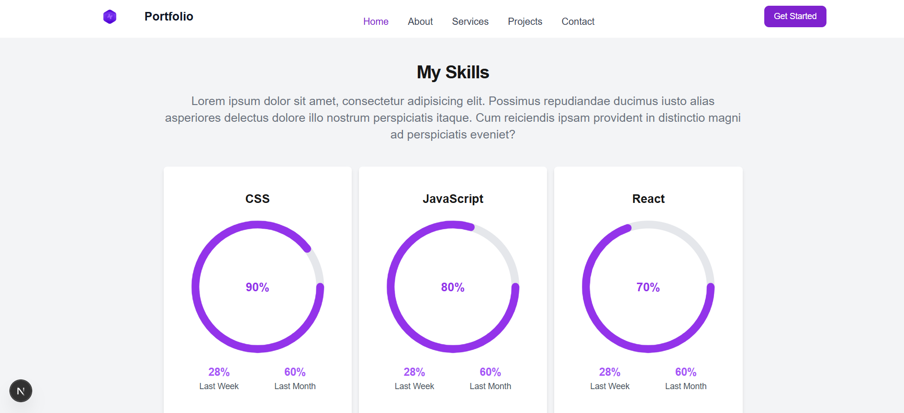
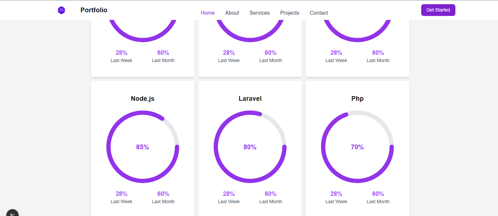
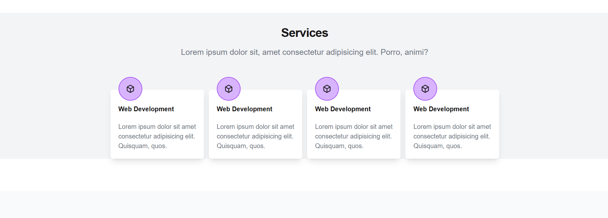
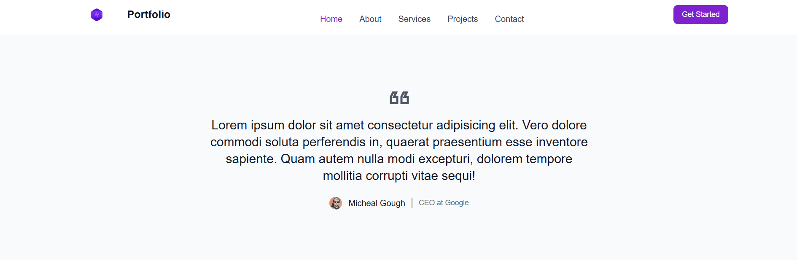
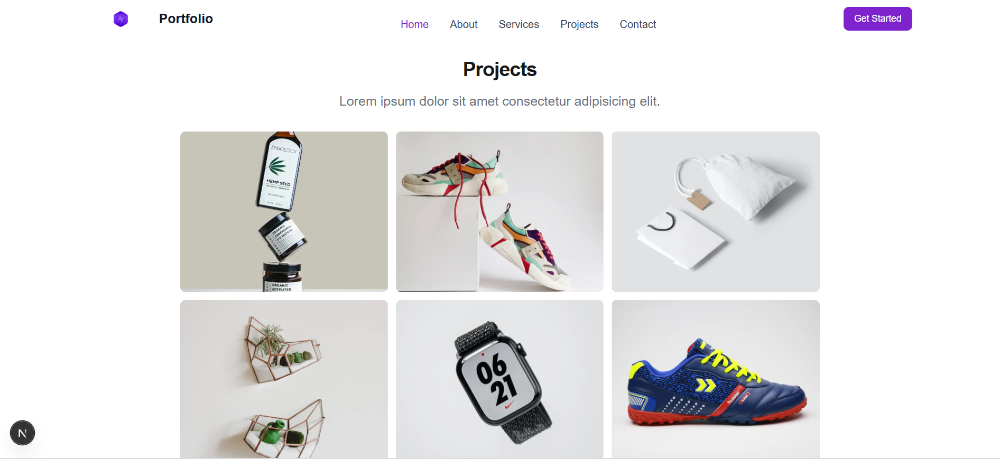
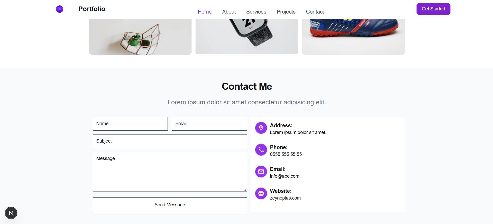

# 🚀 Modern Portfolio Website

A modern and responsive portfolio website built with Next.js 15, React 19, TypeScript, and Tailwind CSS.

## ✨ Features

- 🎨 **Modern Design**: Clean and professional appearance
- 📱 **Responsive**: Perfect display on all devices
- ⚡ **Fast**: Performance optimized with Next.js 15
- 🎯 **SEO Friendly**: Optimized for search engines
- 🌈 **Tailwind CSS**: Styling with modern CSS framework
- 🔧 **TypeScript**: Type safety and better developer experience

## 🛠️ Technologies

- **Frontend Framework**: Next.js 15
- **UI Library**: React 19
- **Styling**: Tailwind CSS
- **Language**: TypeScript
- **UI Components**: Flowbite
- **Build Tool**: Turbopack

## 📸 Screenshots

### Homepage


### About Section


### Skills Section



### Services Section


### Testimonials Section


### Projects


### Contact


## 🚀 Installation

To run the project on your local machine:

```bash
# Clone the repository
git clone https://github.com/username/portfolio.git

# Navigate to project directory
cd portfolio

# Install dependencies
npm install

# Start development server
npm run dev
```

Open [http://localhost:3000](http://localhost:3000) in your browser.

## 📁 Project Structure

```
portfolio/
├── src/
│   ├── app/
│   │   ├── layout.tsx      # Main layout
│   │   ├── page.tsx        # Home page
│   │   └── globals.css     # Global styles
│   └── img/                # Images
├── public/                  # Static files
├── tailwind.config.js       # Tailwind configuration
└── package.json            # Project dependencies
```

## 🎯 Usage

### Development
```bash
npm run dev
```

### Production Build
```bash
npm run build
npm start
```

### Linting
```bash
npm run lint
```

## 🌟 Features Detail

### 1. **Hero Section**
- Impressive title and description
- Call-to-action buttons
- Profile photo

### 2. **Statistics**
- Completed project count
- Happy client count
- Years of experience

### 3. **About Me**
- Personal information
- Professional photo
- Detailed description

### 4. **Skills**
- Visual skill bars
- Progress tracking
- Hover effects

### 5. **Services**
- Web development
- UI/UX design
- Mobile application
- SEO optimization

### 6. **Projects**
- Portfolio gallery
- Hover effects
- Responsive grid layout

### 7. **Contact**
- Contact form
- Contact information
- Map integration

## 🎨 Design Features

- **Color Palette**: Purple tones and gray tones
- **Typography**: Modern and readable fonts
- **Spacing**: Consistent spacing system
- **Animations**: Smooth hover and transition effects
- **Icons**: SVG icons

## 📱 Responsive Design

- **Mobile First**: Mobile-first design approach
- **Breakpoints**: Tailwind CSS breakpoint system
- **Grid System**: Responsive grid layout
- **Navigation**: Mobile hamburger menu

## 🔧 Customization

### Changing Colors
You can customize the color palette in `tailwind.config.js`:

```javascript
module.exports = {
  theme: {
    extend: {
      colors: {
        primary: '#your-color',
        secondary: '#your-color'
      }
    }
  }
}
```

### Updating Content
You can update texts and images in `src/app/page.tsx`.

## 📝 Contributing

1. Fork this repository
2. Create a feature branch (`git checkout -b feature/AmazingFeature`)
3. Commit your changes (`git commit -m 'Add some AmazingFeature'`)
4. Push to the branch (`git push origin feature/AmazingFeature`)
5. Open a Pull Request

## 📄 License

This project was developed for educational/portfolio purposes.

## 📞 Contact

- **Email**: zeyneptas1901@gmail.com
- **LinkedIn**: [LinkedIn Profile](https://www.linkedin.com/in/zeyneptas1/)

## 🙏 Acknowledgments

- [Next.js](https://nextjs.org/) - React framework
- [Tailwind CSS](https://tailwindcss.com/) - CSS framework
- [Flowbite](https://flowbite.com/) - UI components
- [React](https://reactjs.org/) - JavaScript library

---

⭐ Don't forget to star this project if you liked it!
